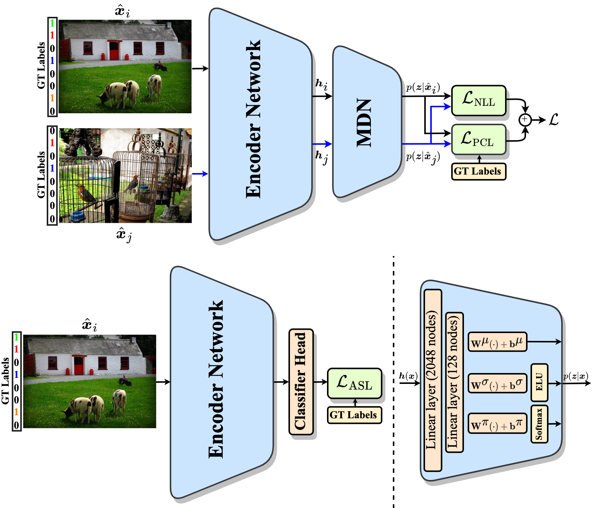

# ProbMCL: Simple Probabilistic Contrastive Learning for Multi-label Visual Classification
Official webpage of "ProbMCL: Simple Probabilistic Contrastive Learning for Multi-label Visual Classification", published as a conference paper at ICASSP 2024.

## Abstract
Multi-label image classification presents a challenging task in many domains, including computer vision and medical imaging. Recent advancements have introduced graph-based and transformer-based methods to improve performance and capture label dependencies. However, these methods often include complex modules that entail heavy computation and lack interpretability. In this paper, we propose Probabilistic Multi-label Contrastive Learning (ProbMCL), a novel framework to address these challenges in multi-label image classification tasks. Our simple yet effective approach employs supervised contrastive learning, in which samples that share enough labels with an anchor image based on a decision threshold are introduced as a positive set. This structure captures label dependencies by pulling positive pair embeddings together and pushing away negative samples that fall below the threshold. We enhance representation learning by incorporating a mixture density network into contrastive learning and generating Gaussian mixture distributions to explore the epistemic uncertainty of the feature encoder. We validate the effectiveness of our framework through experimentation with datasets from the computer vision and medical imaging domains. Our method outperforms the existing state-of-the-art methods while achieving a low computational footprint on both datasets. Visualization analyses also demonstrate that ProbMCL-learned classifiers maintain a meaningful semantic topology.

## Comming soon (due to Patent Disclosure)

## Website License
 This work is licensed under a <a rel="license" href="http://creativecommons.org/licenses/by-sa/4.0/">Creative Commons Attribution-ShareAlike 4.0 International License</a>.
